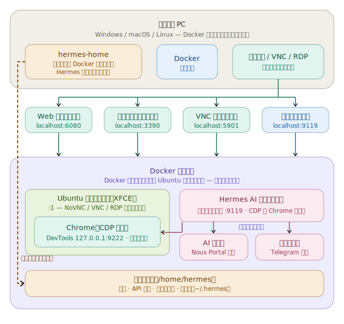

# Hermes Agent Desktop Docker

🌐 [English](README.md) | [한국어](README.ko.md) | [中文](README.zh.md) | [日本語](README.ja.md)


**Hermes Agent**（Nous Research）をプリインストールした、すぐに使える Ubuntu 24.04 + XFCE4 デスクトップで、**安全なブラウザ自動化**を実現します。CDP 対応の Chrome が `:1` ディスプレイ上で動作し、Hermes の `/browser` がそれを操作します。その間、あなたは Web（NoVNC）、VNC、または RDP 経由で様子を見ながら操作できます。**追加の権限なし**（`docker compose up`）で動作します。

## アーキテクチャ

<p align="center">
  
</p>

## 含まれるもの

| コンポーネント | 詳細 |
|---|---|
| **ベース OS** | Ubuntu 24.04 |
| **デスクトップ** | CJK + 絵文字フォント付きの XFCE4 |
| **リモートアクセス** | TigerVNC + NoVNC（Web）、xRDP（リモートデスクトップ）、生の VNC — すべて同じ `:1` デスクトップに集約 |
| **ブラウザ自動化** | CDP 対応の Chrome（amd64）/ Chromium（arm64）を、Hermes `/browser` が CDP `127.0.0.1:9222`（コンテナ内のみ）経由で操作 |
| **Hermes Agent** | プリインストール済み・バージョン固定。設定は事前投入済み。モデル/プロバイダーは未設定（実行時に設定） |
| **ダッシュボード** | `:9119` 上の Web ダッシュボード — Status、Chat（TUI）、Config、API Keys、Sessions、Skills、MCP、Logs、Cron、Channels（ログイン必須） |
| **デスクトップショートカット** | Hermes Setup、Hermes Dashboard、Hermes Terminal |
| **権限** | **追加の権限なし**で動作。CDP はループバックにバインド。ダッシュボード認証は scrypt ハッシュ |

## 同梱バージョン

| パッケージ | バージョン |
|---|---|
| **Hermes Agent** | `v0.17.0`（2026.6.19）— 固定コミット `dd0e4ab` |
| **Ubuntu** | `24.04.4 LTS` |
| **XFCE4** | `4.18.3` |
| **Google Chrome**（amd64） | `149.0.7827.200` |
| **Chromium**（arm64） | `ppa:xtradeb/apps` の最新版 |
| **Node.js** | `v22.23.1` |
| **Python** | `3.12.3` |
| **TigerVNC** | `1.13.1` |
| **noVNC** / **websockify** | `1.3.0` / `0.10.0` |
| **xRDP** | `0.9.24` |

## 対応アーキテクチャ

| プラットフォーム | ブラウザ | ステータス |
|---|---|---|
| `linux/amd64` | Google Chrome 安定版（CDP） | ✅ CI で検証済み |
| `linux/arm64` | `ppa:xtradeb/apps` の Chromium（CDP） | ✅ ネイティブ arm64 CDP を CI で検証済み |

`docker pull` は、マルチアーキテクチャマニフェストを通じて、お使いの CPU に合ったバリアントを自動選択します。

## ポート

| ポート | サービス |
|---|---|
| `6080` | NoVNC — Web デスクトップ（`/vnc.html`） |
| `5901` | VNC — 直接クライアント |
| `3390` → `3389` | RDP — リモートデスクトップ / Remmina（ホスト `3390` → コンテナ `3389`） |
| `9119` | Hermes Web ダッシュボード |
| `9222` | Chrome DevTools / CDP — **コンテナ内のみ、未公開** |

## クイックスタート

```bash
cp .env.example .env        # then edit HERMES_USER / HERMES_PASSWORD
docker compose up -d
```

次に <http://localhost:9119> で**ダッシュボード**を開き、API Keys タブでモデルと API キー（Nous Portal 推奨）を設定するか、「Hermes Setup」デスクトップショートカットから `hermes setup` を実行します。

> ソースからビルドする代わりに公開イメージを使いたい場合は、`neoplanetz/hermes-desktop-docker:latest` をプルしてください。すぐに使える `compose.yaml` と完全なパラメータ表については [Docker Hub 概要](DOCKERHUB_OVERVIEW.md) を参照してください。

## アクセス

| 接続方法 | アドレス | ログイン |
|---|---|---|
| Web デスクトップ（NoVNC） | <http://localhost:6080/vnc.html> | VNC パスワード = `HERMES_PASSWORD` |
| 生の VNC クライアント | `localhost:5901` | `HERMES_PASSWORD` |
| RDP クライアント | `localhost:3390` | `HERMES_USER` / `HERMES_PASSWORD` |
| Web ダッシュボード | <http://localhost:9119> | `HERMES_USER` / `HERMES_PASSWORD` |

3 つのリモートデスクトップ経路はすべて**同じ** `:1` デスクトップに集約されるため、どの方法で接続してもエージェントのブラウザ操作が見えます（`docs/ACCESS-MODEL.md` を参照）。デフォルトの認証情報は `hermes` / `hermes123` です — **ループバックを超えてポートを公開する前に、必ず変更してください。**

## エージェントができること

- **ブラウザ自動化（CDP）** — CDP 対応の Chrome が `:1` 上で自動起動し、Hermes `/browser` が CDP（`127.0.0.1:9222`、ホストには一切公開されない）経由で接続します。これにより、NoVNC/RDP で見ている間に、エージェントが Web ページを読み取り・操作できます。
- **観察可能なデスクトップ** — NoVNC / VNC / RDP はすべて同じ `:1` セッションを表示するため、自動化をライブで見ながら手動で介入できます。
- **ダッシュボード** — Status、Chat（埋め込み TUI）、Config、API Keys、Sessions、Skills、MCP、Logs、Cron、Channels。

## 設定

- `HERMES_USER` / `HERMES_PASSWORD` — デスクトップアカウント。VNC/RDP とダッシュボードのログインに使用します。`.env` で設定します。
- モデル/プロバイダーはデフォルトで未設定です — 実行時にダッシュボードで設定します。

## データ永続化

- ユーザーごとの状態は、ユーザーのホームにマウントされた `hermes-home` Docker ボリュームに永続化されます。`~/.hermes` には設定、API キー、セッション、スキルが保存されます。
- ボリュームパスは `HERMES_USER` に従います（例: `/home/hermes`）。`HERMES_USER` を変更すると、ホームボリュームはそれに応じて `/home/<user>` にマウントされます。

## セキュリティ

- ダッシュボードはコンテナ内では `0.0.0.0` にバインドされますが、ホストには `127.0.0.1:9119` のみで公開され、**常にログインが必須**です（scrypt ハッシュ化されたパスワード認証。平文は保存されません）。LAN への公開はオプトインです — `docker-compose.yml` のポートマッピングを編集し、強力な `HERMES_PASSWORD` を使用してください。
- VNC パスワードとダッシュボードの認証情報はコンテナ起動時に生成されます（モード 600、コンテナ内のみ）— イメージに焼き込まれることも、コミットされることもありません。
- CDP ポート（`9222`）はコンテナの**内部**でループバックにバインドされ、ホストには公開されないため、自動化サーフェスが外部から到達されることは決してありません。

## 既知の制限

- **`computer_use` による、ネイティブ GTK アプリへのキーボード/マウス入力はサポートされていません（このイメージの対象外です）。** 根本原因は GTK ではなく **X サーバー**です。このイメージは TigerVNC `Xvnc` を実行しており、これは組み込みの VNC/XTEST 入力のみを公開し、**`uinput`/`libinput` の仮想入力デバイスを受け付けません**。そのため cua-driver のネイティブ Linux 実入力パスは接続できず、`XSendEvent`（合成イベント）にフォールバックしますが、これは GTK が無視します。サポートされている安全な経路は **CDP 経由のブラウザ自動化**であり、こちらは動作します。詳細な分析は `docs/E2E-ACCEPTANCE.md` にあります。

## ライセンスとリンク

- Docker Hub: <https://hub.docker.com/r/neoplanetz/hermes-desktop-docker>
- Hermes Agent（Nous Research）: <https://hermes-agent.nousresearch.com>
