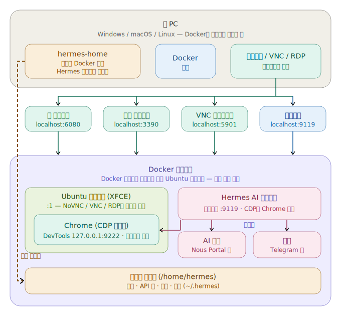

# Hermes Agent Desktop Docker

🇺🇸 [English](README.md) | 🇰🇷 [한국어](README.ko.md) | 🇨🇳 [中文](README.zh.md) | 🇯🇵 [日本語](README.ja.md)

> 🔰 **Docker가 처음이신가요?** [초보자 가이드](docs/GUIDE_FOR_BEGINNERS.ko.md)부터 시작하세요 — 경험이 없어도 됩니다.


**안전한 브라우저 자동화**를 위해 **Hermes Agent**(Nous Research)가 사전 설치된, 즉시 사용 가능한
Ubuntu 24.04 + XFCE4 데스크톱입니다. CDP가 활성화된 Chrome이 `:1` 디스플레이에서 실행되고
Hermes의 `/browser`가 이를 제어하며, 그동안 사용자는 웹(NoVNC), VNC 또는 RDP를 통해 지켜보고
조종할 수 있습니다. **추가 권한 없이**(`docker compose up`) 실행됩니다.

## 아키텍처

<p align="center">
  
</p>

## 실제 동작 보기

루프백 전용 Chrome DevTools Protocol로 구동되는 번들 Chrome과 내장 Hermes 대시보드 — 접속하는 바로 그 데스크톱에서 NoVNC/RDP로 함께 확인·관리합니다.

<p align="center">
  
  
</p>

## 포함 사항

| 구성 요소 | 세부 정보 |
|---|---|
| **기본 OS** | Ubuntu 24.04 |
| **데스크톱** | CJK + 이모지 폰트가 포함된 XFCE4 |
| **원격 접속** | TigerVNC + NoVNC(웹), xRDP(원격 데스크톱), 원시 VNC — 모두 동일한 `:1` 데스크톱으로 수렴 |
| **브라우저 자동화** | CDP가 활성화된 Chrome(amd64) / Chromium(arm64), CDP `127.0.0.1:9222`(컨테이너 내부 전용)를 통해 Hermes `/browser`가 제어 |
| **Hermes Agent** | 사전 설치 및 버전 고정; 설정 사전 구성; 모델/공급자 미설정(런타임에 설정) |
| **대시보드** | `:9119`의 웹 대시보드 — 상태, 채팅(TUI), 설정, API 키, 세션, 스킬, MCP, 로그, Cron, 채널(로그인 필요) |
| **데스크톱 바로 가기** | Hermes Setup, Hermes Dashboard, Hermes Terminal |
| **권한** | **추가 권한 없이** 실행; CDP는 루프백에 바인딩; scrypt 해시 처리된 대시보드 인증 |

## 번들 버전

| 패키지 | 버전 |
|---|---|
| **Hermes Agent** | `v0.17.0` (2026.6.19) — 고정 커밋 `dd0e4ab` |
| **Ubuntu** | `24.04.4 LTS` |
| **XFCE4** | `4.18.3` |
| **Google Chrome** (amd64) | `149.0.7827.200` |
| **Chromium** (arm64) | `ppa:xtradeb/apps`의 최신 버전 |
| **Node.js** | `v22.23.1` |
| **Python** | `3.12.3` |
| **TigerVNC** | `1.13.1` |
| **noVNC** / **websockify** | `1.3.0` / `0.10.0` |
| **xRDP** | `0.9.24` |

## 지원 아키텍처

| 플랫폼 | 브라우저 | 상태 |
|---|---|---|
| `linux/amd64` | Google Chrome 안정 버전 (CDP) | ✅ CI에서 검증됨 |
| `linux/arm64` | `ppa:xtradeb/apps`의 Chromium (CDP) | ✅ 네이티브 arm64 CDP가 CI에서 검증됨 |

`docker pull`은 멀티 아키텍처 매니페스트를 통해 사용자 CPU에 맞는 변형을 자동으로 선택합니다.

## 포트

| 포트 | 서비스 |
|---|---|
| `6080` | NoVNC — 웹 데스크톱 (`/vnc.html`) |
| `5901` | VNC — 직접 클라이언트 |
| `3390` → `3389` | RDP — 원격 데스크톱 / Remmina (호스트 `3390` → 컨테이너 `3389`) |
| `9119` | Hermes 웹 대시보드 |
| `9222` | Chrome DevTools / CDP — **컨테이너 내부 전용, 게시되지 않음** |

## 빠른 시작

```bash
cp .env.example .env        # then edit HERMES_USER / HERMES_PASSWORD
docker compose up -d
```

그런 다음 <http://localhost:9119>에서 **대시보드**를 열고 API 키 탭에서 모델 + API 키
(Nous Portal 권장)를 설정하거나, "Hermes Setup" 데스크톱 바로 가기에서 `hermes setup`을
실행하세요.

> 소스에서 빌드하는 대신 게시된 이미지를 선호하시나요?
> `neoplanetz/hermes-desktop-docker:latest`를 받으세요 — 바로 사용할 수 있는 `compose.yaml`과
> 전체 매개변수 표는 [Docker Hub 개요](DOCKERHUB_OVERVIEW.md)를 참조하세요.

## 소스에서 빌드하기

`docker-compose.yml`에 이 저장소의 `Dockerfile`을 가리키는 `build:` 항목이 이미
들어 있으므로, 소스 빌드는 명령 한 줄이면 됩니다:

```bash
docker compose up -d --build    # 로컬 변경 후 강제 재빌드
```

재빌드와 **함께** 전체 검증 스위트(모든 `verify-*` 게이트)를 한 번에 돌리려면 —
⚠️ 파괴적: 마지막에 `docker compose down -v`로 스택을 내리면서 `hermes-home`
볼륨을 삭제합니다:

```bash
scripts/verify-all.sh
```

로컬 빌드는 현재 머신의 아키텍처만 대상으로 합니다. Docker Hub로의 멀티 아키텍처
이미지 게시는 의도적으로 수동 절차가 **아닙니다**: 게시는 서명 릴리스 파이프라인
(`git tag vX.Y.Z && git push origin vX.Y.Z` → `release.yml`)을 통해서만
이루어지며, 덕분에 모든 공개 태그는 cosign으로 검증할 수 있습니다 —
[이미지 검증](#이미지-검증)을 참조하세요.

## 접속

| 접속 방식 | 주소 | 로그인 |
|---|---|---|
| 웹 데스크톱 (NoVNC) | <http://localhost:6080/vnc.html> | VNC 비밀번호 = `HERMES_PASSWORD` |
| 원시 VNC 클라이언트 | `localhost:5901` | `HERMES_PASSWORD` |
| RDP 클라이언트 | `localhost:3390` | `HERMES_USER` / `HERMES_PASSWORD` |
| 웹 대시보드 | <http://localhost:9119> | `HERMES_USER` / `HERMES_PASSWORD` |

세 가지 원격 데스크톱 경로 모두 **동일한** `:1` 데스크톱으로 수렴하므로, 어떤 방식으로
연결하든 에이전트의 브라우저 동작을 볼 수 있습니다(`docs/ACCESS-MODEL.md` 참조). 기본 자격
증명은 `hermes` / `hermes123`입니다 — **루프백을 벗어나 포트를 노출하기 전에 변경하세요.**

## 에이전트가 할 수 있는 일

- **브라우저 자동화(CDP)** — CDP가 활성화된 Chrome이 `:1`에서 자동 시작되고, Hermes
  `/browser`가 CDP(`127.0.0.1:9222`, 호스트에 절대 노출되지 않음)를 통해 연결되므로,
  사용자가 NoVNC/RDP로 지켜보는 동안 에이전트가 웹 페이지를 읽고 제어할 수 있습니다.
- **관찰 가능한 데스크톱** — NoVNC / VNC / RDP 모두 동일한 `:1` 세션을 보여주므로,
  자동화를 실시간으로 지켜보고 직접 개입할 수 있습니다.
- **대시보드** — 상태, 채팅(내장 TUI), 설정, API 키, 세션, 스킬, MCP, 로그, Cron, 채널.

## 구성

- `HERMES_USER` / `HERMES_PASSWORD` — 데스크톱 계정으로, VNC/RDP 및 대시보드 로그인에
  사용됩니다. `.env`에서 설정합니다.
- `HERMES_CDP_BROWSER` — `false`로 설정하면 부팅 시 화면에 보이는 CDP 크롬을 띄우지
  않습니다(기본값 `true`). Hermes `/browser`는 이 브라우저에 연결하므로, CDP 브라우저가
  실행되기 전까지는 동작하지 않습니다.
- 모델/공급자는 기본적으로 설정되어 있지 않습니다 — 런타임에 대시보드에서 구성하세요.

## 데이터 영속성

- 사용자별 상태는 사용자 홈에 마운트된 `hermes-home` Docker 볼륨에 영속적으로 저장되며,
  `~/.hermes`에는 설정, API 키, 세션, 스킬이 보관됩니다.
- 볼륨 경로는 `HERMES_USER`를 따릅니다(예: `/home/hermes`). `HERMES_USER`를 변경하면
  홈 볼륨이 그에 따라 `/home/<user>`에 마운트됩니다.

## 보안

- 대시보드는 컨테이너 내부에서 `0.0.0.0`에 바인딩되지만 호스트에는 `127.0.0.1:9119`로만
  게시되며, **항상 로그인이 필요합니다**(scrypt 해시 비밀번호 인증; 평문 저장 없음). LAN
  노출은 선택 사항입니다 — `docker-compose.yml`의 포트 매핑을 편집하고 강력한
  `HERMES_PASSWORD`를 사용하세요.
- VNC 비밀번호와 대시보드 인증 자료는 컨테이너 시작 시 생성되며(모드 600, 컨테이너 내부
  전용), 이미지에 포함되거나 커밋되지 않습니다.
- CDP 포트(`9222`)는 컨테이너 **내부**에서 루프백에 바인딩되며 호스트에 게시되지 않으므로,
  자동화 표면은 외부에서 절대 접근할 수 없습니다.

## 알려진 제한 사항

- **`computer_use`를 통한 네이티브 GTK 앱으로의 키보드/마우스 입력은 지원되지 않습니다
  (이 이미지의 범위를 벗어남).** 근본 원인은 GTK가 아니라 **X 서버**입니다. 이 이미지는
  TigerVNC `Xvnc`를 실행하는데, 이는 내장된 VNC/XTEST 입력만 노출하고 **`uinput`/`libinput`
  가상 입력 장치를 허용하지 않으므로**, cua-driver의 네이티브 Linux 실제 입력 경로가
  연결되지 못하고 `XSendEvent`(합성 이벤트)로 폴백되며, 이는 GTK가 무시합니다. 지원되는
  안전한 경로는 정상 작동하는 **CDP를 통한 브라우저 자동화**입니다. 전체 분석은
  `docs/E2E-ACCEPTANCE.md`에 있습니다.

## 이미지 검증

모든 `vX.Y.Z` 릴리스는 GitHub Actions에서 빌드되어 **cosign 키리스 서명**(Sigstore)되며,
SPDX **SBOM** 와 **SLSA provenance** 증명이 첨부됩니다. 실행 전에 검증하세요
([cosign](https://docs.sigstore.dev/cosign/installation/) 필요):

```bash
IMAGE=neoplanetz/hermes-desktop-docker:latest
IDENTITY='^https://github\.com/Neoplanetz/hermes-agent-desktop-docker/\.github/workflows/release\.yml@refs/tags/v'
ISSUER=https://token.actions.githubusercontent.com

cosign verify              "$IMAGE" --certificate-identity-regexp "$IDENTITY" --certificate-oidc-issuer "$ISSUER"
cosign verify-attestation  "$IMAGE" --type spdxjson       --certificate-identity-regexp "$IDENTITY" --certificate-oidc-issuer "$ISSUER"
cosign verify-attestation  "$IMAGE" --type slsaprovenance1 --certificate-identity-regexp "$IDENTITY" --certificate-oidc-issuer "$ISSUER"
```

`cosign verify` 가 성공하면 서명이 검증된 것이고, 두 `verify-attestation` 호출은 SBOM 과
provenance 가 이 저장소의 릴리스 워크플로로 서명되었음을 확인합니다.

## 라이선스 및 링크

이 저장소(Dockerfile, 스크립트, 설정, 문서)는 **[MIT 라이선스](LICENSE)**로
배포됩니다. Hermes Agent 자체는 빌드 시 다운로드되며 Nous Research의 자체
라이선스를 따릅니다.

- Docker Hub: <https://hub.docker.com/r/neoplanetz/hermes-desktop-docker>
- Hermes Agent (Nous Research): <https://hermes-agent.nousresearch.com>
