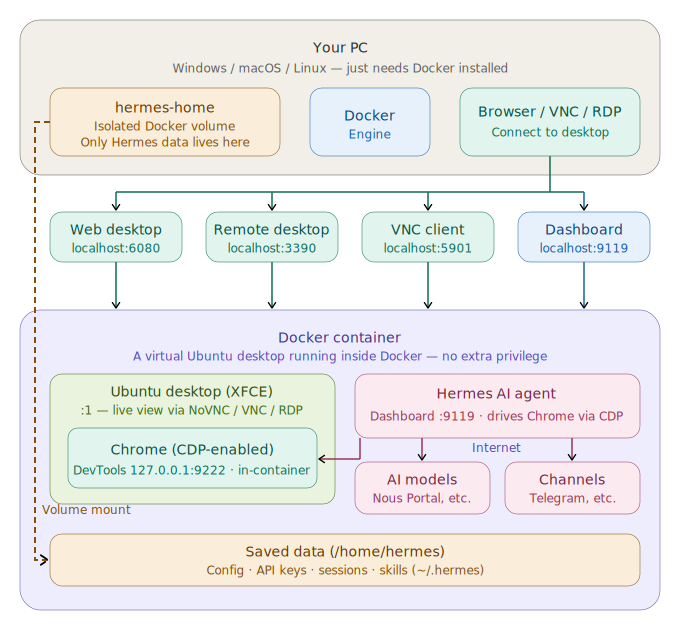
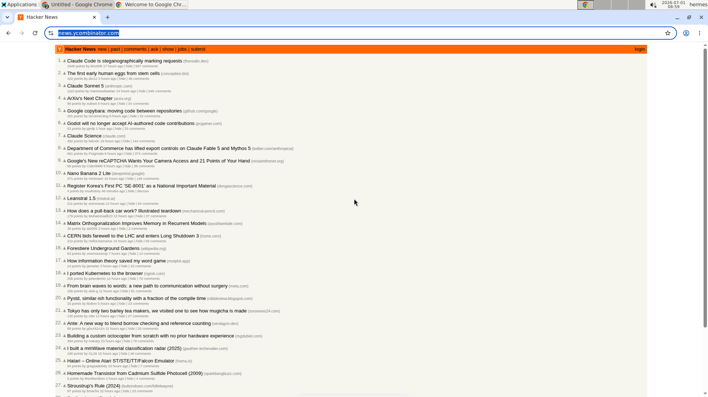
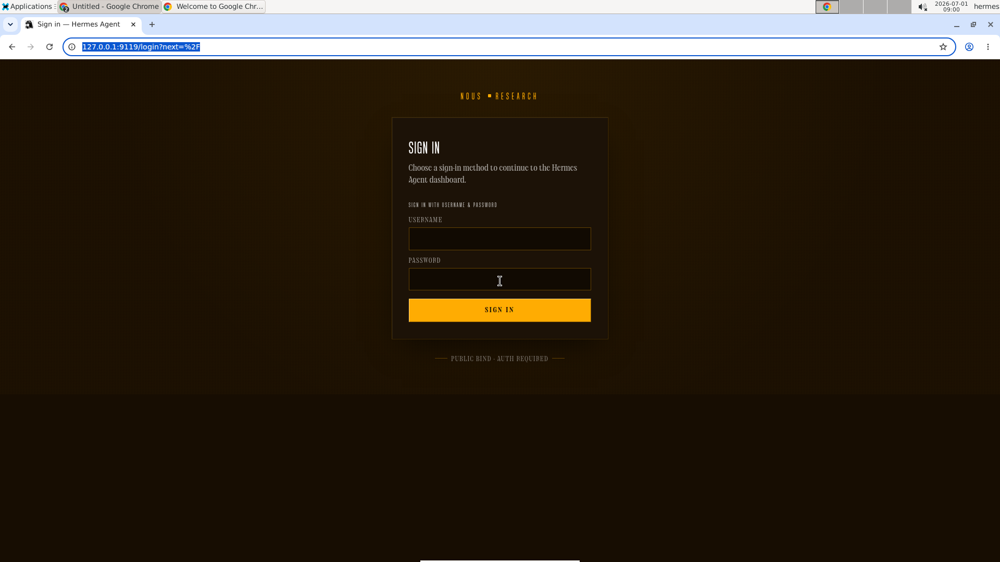

# Hermes Agent Desktop Docker

🇺🇸 [English](README.md) | 🇰🇷 [한국어](README.ko.md) | 🇨🇳 [中文](README.zh.md) | 🇯🇵 [日本語](README.ja.md)

> 🔰 **New to Docker?** Start with the [beginner's guide](docs/GUIDE_FOR_BEGINNERS.md) — no experience needed.


A turnkey Ubuntu 24.04 + XFCE4 desktop with **Hermes Agent** (Nous Research)
pre-installed for **secure browser automation**: a CDP-enabled Chrome runs on
the `:1` display and Hermes' `/browser` drives it, while you watch and steer over
the web (NoVNC), VNC, or RDP. Runs with **no extra privilege** (`docker compose up`).

## Architecture

<p align="center">
  
</p>

## See it in action

The bundled Chrome, driven over the Chrome DevTools Protocol (loopback-only), and the built-in Hermes dashboard — both watched and managed over NoVNC/RDP on the same desktop you connect to.

<p align="center">
  
  
</p>

## What's Included

| Component | Details |
|---|---|
| **Base OS** | Ubuntu 24.04 |
| **Desktop** | XFCE4 with CJK + emoji fonts |
| **Remote access** | TigerVNC + NoVNC (web), xRDP (Remote Desktop), raw VNC — all converge on the same `:1` desktop |
| **Browser automation** | CDP-enabled Chrome (amd64) / Chromium (arm64), driven by Hermes `/browser` over CDP `127.0.0.1:9222` (in-container only) |
| **Hermes Agent** | Pre-installed & pinned; config pre-seeded; model/provider unset (set at runtime) |
| **Dashboard** | Web dashboard on `:9119` — Status, Chat (TUI), Config, API Keys, Sessions, Skills, MCP, Logs, Cron, Channels (login required) |
| **Desktop shortcuts** | Hermes Setup, Hermes Dashboard, Hermes Terminal |
| **Privilege** | Runs with **no extra privilege**; CDP bound to loopback; scrypt-hashed dashboard auth |

## Bundled Versions

| Package | Version |
|---|---|
| **Hermes Agent** | `v0.17.0` (2026.6.19) — pinned commit `dd0e4ab` |
| **Ubuntu** | `24.04.4 LTS` |
| **XFCE4** | `4.18.3` |
| **Google Chrome** (amd64) | `149.0.7827.200` |
| **Chromium** (arm64) | latest from `ppa:xtradeb/apps` |
| **Node.js** | `v22.23.1` |
| **Python** | `3.12.3` |
| **TigerVNC** | `1.13.1` |
| **noVNC** / **websockify** | `1.3.0` / `0.10.0` |
| **xRDP** | `0.9.24` |

## Supported Architectures

| Platform | Browser | Status |
|---|---|---|
| `linux/amd64` | Google Chrome stable (CDP) | ✅ verified in CI |
| `linux/arm64` | Chromium from `ppa:xtradeb/apps` (CDP) | ✅ native-arm64 CDP verified in CI |

`docker pull` auto-selects the variant for your CPU via the multi-arch manifest.

## Ports

| Port | Service |
|---|---|
| `6080` | NoVNC — web desktop (`/vnc.html`) |
| `5901` | VNC — direct client |
| `3390` → `3389` | RDP — Remote Desktop / Remmina (host `3390` → container `3389`) |
| `9119` | Hermes web dashboard |
| `9222` | Chrome DevTools / CDP — **in-container only, not published** |

## Quick start

```bash
cp .env.example .env        # then edit HERMES_USER / HERMES_PASSWORD
docker compose up -d
```

Then open the **dashboard** at <http://localhost:9119> and set a model + API key
(Nous Portal recommended) in the API Keys tab, or run `hermes setup` from the
"Hermes Setup" desktop shortcut.

> Prefer the published image over building from source? Pull
> `neoplanetz/hermes-desktop-docker:latest` — see the
> [Docker Hub overview](DOCKERHUB_OVERVIEW.md) for a ready-to-use `compose.yaml`
> and a full parameter table.

## Building from source

`docker-compose.yml` already carries a `build:` stanza pointing at this repo's
`Dockerfile`, so a from-source build is a single command:

```bash
docker compose up -d --build    # force a rebuild after local changes
```

To rebuild **and** run the full verification suite (all `verify-*` gates) in
one go — ⚠️ destructive: it finishes with `docker compose down -v`, wiping the
`hermes-home` volume:

```bash
scripts/verify-all.sh
```

Local builds target your machine's architecture only. Publishing multi-arch
images to Docker Hub is deliberately **not** a manual step: it happens
exclusively through the signed release pipeline
(`git tag vX.Y.Z && git push origin vX.Y.Z` → `release.yml`), so every public
tag stays cosign-verifiable — see
[Verifying the image](#verifying-the-image).

## Access

| Surface | Address | Login |
|---|---|---|
| Web desktop (NoVNC) | <http://localhost:6080/vnc.html> | VNC password = `HERMES_PASSWORD` |
| Raw VNC client | `localhost:5901` | `HERMES_PASSWORD` |
| RDP client | `localhost:3390` | `HERMES_USER` / `HERMES_PASSWORD` |
| Web dashboard | <http://localhost:9119> | `HERMES_USER` / `HERMES_PASSWORD` |

All three remote-desktop paths converge on the **same** `:1` desktop, so the
agent's browser actions are visible no matter how you connect
(see `docs/ACCESS-MODEL.md`). Default credentials are `hermes` / `hermes123` —
**change them before exposing any port beyond loopback.**

## What the agent can do

- **Browser automation (CDP)** — a CDP-enabled Chrome autostarts on `:1`; Hermes
  `/browser` attaches over CDP (`127.0.0.1:9222`, never exposed to the host) so the
  agent can read and drive web pages while you watch over NoVNC/RDP.
- **Observable desktop** — NoVNC / VNC / RDP all show the same `:1` session, so you
  can watch the automation live and intervene by hand.
- **Dashboard** — Status, Chat (embedded TUI), Config, API Keys, Sessions,
  Skills, MCP, Logs, Cron, Channels.

## Configuration

- `HERMES_USER` / `HERMES_PASSWORD` — desktop account, used for VNC/RDP and the
  dashboard login. Set in `.env`.
- `HERMES_CDP_BROWSER` — set to `false` to skip launching the visible CDP Chrome
  at boot (default `true`). Hermes `/browser` attaches to that browser, so it
  won't work until a CDP browser is started.
- Model/provider are unset by default — configure at runtime in the dashboard.

## Data persistence

- Per-user state persists in the `hermes-home` Docker volume mounted at the user's
  home; `~/.hermes` holds config, API keys, sessions, and skills.
- The volume path follows `HERMES_USER` (e.g. `/home/hermes`). If you change
  `HERMES_USER`, the home volume mounts at `/home/<user>` accordingly.

## Security

- The dashboard binds `0.0.0.0` inside the container but is host-published to
  `127.0.0.1:9119` only, and **always requires login** (scrypt-hashed password
  auth; no plaintext stored). LAN exposure is opt-in — edit the port mappings in
  `docker-compose.yml` and use a strong `HERMES_PASSWORD`.
- The VNC password and dashboard auth material are generated at container start
  (mode 600, in-container only) — never baked into the image or committed.
- The CDP port (`9222`) is bound to loopback **inside** the container and is not
  published to the host, so the automation surface is never reachable externally.

## Known limitations

- **Keyboard/mouse input into native GTK apps via `computer_use` is not supported
  (out of scope for this image).** Root cause is the **X server**, not GTK: this
  image runs TigerVNC `Xvnc`, which exposes only its built-in VNC/XTEST input and
  **does not accept `uinput`/`libinput` virtual input devices**, so cua-driver's
  native Linux real-input path can't attach and falls back to `XSendEvent`
  (synthetic events), which GTK ignores. The supported, secure path is
  **browser automation over CDP**, which works. Full analysis in
  `docs/E2E-ACCEPTANCE.md`.

## Verifying the image

Every `vX.Y.Z` release is built in GitHub Actions and **keyless-signed with cosign**
(Sigstore), with an SPDX **SBOM** and **SLSA provenance** attestation attached. Verify
before you run it (needs [cosign](https://docs.sigstore.dev/cosign/installation/)):

```bash
IMAGE=neoplanetz/hermes-desktop-docker:latest
IDENTITY='^https://github\.com/Neoplanetz/hermes-agent-desktop-docker/\.github/workflows/release\.yml@refs/tags/v'
ISSUER=https://token.actions.githubusercontent.com

cosign verify              "$IMAGE" --certificate-identity-regexp "$IDENTITY" --certificate-oidc-issuer "$ISSUER"
cosign verify-attestation  "$IMAGE" --type spdxjson       --certificate-identity-regexp "$IDENTITY" --certificate-oidc-issuer "$ISSUER"
cosign verify-attestation  "$IMAGE" --type slsaprovenance1 --certificate-identity-regexp "$IDENTITY" --certificate-oidc-issuer "$ISSUER"
```

A successful `cosign verify` prints the verified signature; the two `verify-attestation`
calls confirm the SBOM and provenance were signed by this repo's release workflow.

## License & links

This repository (Dockerfile, scripts, configs, docs) is licensed under the
**[MIT License](LICENSE)**. Hermes Agent itself is downloaded at build time and
remains under its own license from Nous Research.

- Docker Hub: <https://hub.docker.com/r/neoplanetz/hermes-desktop-docker>
- Hermes Agent (Nous Research): <https://hermes-agent.nousresearch.com>
