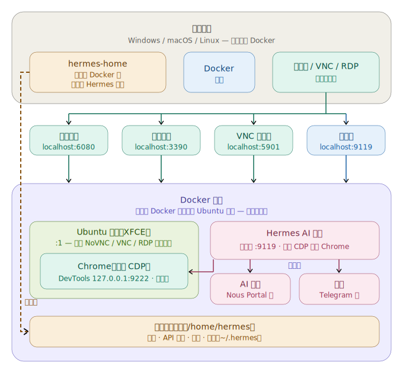

# Hermes Agent Desktop Docker

🇺🇸 [English](README.md) | 🇰🇷 [한국어](README.ko.md) | 🇨🇳 [中文](README.zh.md) | 🇯🇵 [日本語](README.ja.md)

> 🔰 **第一次使用 Docker？** 请从[新手指南](docs/GUIDE_FOR_BEGINNERS.zh.md)开始 — 无需任何经验。


一个开箱即用的 Ubuntu 24.04 + XFCE4 桌面，预装了 **Hermes Agent**（Nous Research），
用于**安全的浏览器自动化**：一个启用了 CDP 的 Chrome 运行在 `:1` 显示器上，由
Hermes 的 `/browser` 驱动，同时你可以通过网页（NoVNC）、VNC 或 RDP 观看并操控。
以**无额外权限**方式运行（`docker compose up`）。

## 架构

<p align="center">
  
</p>

## 实际运行效果

通过仅回环的 Chrome DevTools Protocol 驱动的内置 Chrome，以及内建的 Hermes 仪表板 — 都在你所连接的同一桌面上通过 NoVNC/RDP 查看与管理。

<p align="center">
  
  
</p>

## 包含内容

| 组件 | 详情 |
|---|---|
| **基础操作系统** | Ubuntu 24.04 |
| **桌面** | XFCE4，含 CJK + emoji 字体 |
| **远程访问** | TigerVNC + NoVNC（网页）、xRDP（远程桌面）、原始 VNC —— 全部汇聚到同一个 `:1` 桌面 |
| **浏览器自动化** | 启用 CDP 的 Chrome（amd64）/ Chromium（arm64），由 Hermes `/browser` 通过 CDP `127.0.0.1:9222` 驱动（仅限容器内） |
| **Hermes Agent** | 预装并已固定版本；配置已预置；模型/提供商未设置（运行时设置） |
| **仪表盘** | `:9119` 上的网页仪表盘 —— 状态、聊天（TUI）、配置、API 密钥、会话、技能、MCP、日志、Cron、频道（需登录） |
| **桌面快捷方式** | Hermes Setup、Hermes Dashboard、Hermes Terminal |
| **权限** | 以**无额外权限**方式运行；CDP 绑定到回环地址；仪表盘认证采用 scrypt 哈希 |

## 内置版本

| 软件包 | 版本 |
|---|---|
| **Hermes Agent** | `v0.17.0` (2026.6.19) — pinned commit `dd0e4ab` |
| **Ubuntu** | `24.04.4 LTS` |
| **XFCE4** | `4.18.3` |
| **Google Chrome** (amd64) | `149.0.7827.200` |
| **Chromium** (arm64) | 来自 `ppa:xtradeb/apps` 的最新版本 |
| **Node.js** | `v22.23.1` |
| **Python** | `3.12.3` |
| **TigerVNC** | `1.13.1` |
| **noVNC** / **websockify** | `1.3.0` / `0.10.0` |
| **xRDP** | `0.9.24` |

## 支持的架构

| 平台 | 浏览器 | 状态 |
|---|---|---|
| `linux/amd64` | Google Chrome stable（CDP） | ✅ 已在 CI 中验证 |
| `linux/arm64` | 来自 `ppa:xtradeb/apps` 的 Chromium（CDP） | ✅ 原生 arm64 CDP 已在 CI 中验证 |

`docker pull` 会通过多架构清单为你的 CPU 自动选择对应的变体。

## 端口

| 端口 | 服务 |
|---|---|
| `6080` | NoVNC —— 网页桌面（`/vnc.html`） |
| `5901` | VNC —— 直连客户端 |
| `3390` → `3389` | RDP —— 远程桌面 / Remmina（主机 `3390` → 容器 `3389`） |
| `9119` | Hermes 网页仪表盘 |
| `9222` | Chrome DevTools / CDP —— **仅限容器内，不对外发布** |

## 快速开始

```bash
cp .env.example .env        # then edit HERMES_USER / HERMES_PASSWORD
docker compose up -d
```

然后在 <http://localhost:9119> 打开**仪表盘**，在 API Keys 标签页中设置模型 + API
密钥（推荐使用 Nous Portal），或从 “Hermes Setup” 桌面快捷方式运行 `hermes setup`。

> 相比从源码构建，更想直接使用已发布的镜像？拉取
> `neoplanetz/hermes-desktop-docker:latest` —— 参见
> [Docker Hub 概览](DOCKERHUB_OVERVIEW.md)，其中提供了开箱即用的 `compose.yaml`
> 和完整的参数表。

## 访问方式

| 接入方式 | 地址 | 登录 |
|---|---|---|
| 网页桌面（NoVNC） | <http://localhost:6080/vnc.html> | VNC 密码 = `HERMES_PASSWORD` |
| 原始 VNC 客户端 | `localhost:5901` | `HERMES_PASSWORD` |
| RDP 客户端 | `localhost:3390` | `HERMES_USER` / `HERMES_PASSWORD` |
| 网页仪表盘 | <http://localhost:9119> | `HERMES_USER` / `HERMES_PASSWORD` |

这三种远程桌面路径都汇聚到**同一个** `:1` 桌面，因此无论你以何种方式连接，都能看到
代理的浏览器操作（参见 `docs/ACCESS-MODEL.md`）。默认凭据是 `hermes` / `hermes123` ——
**在将任何端口暴露到回环地址之外之前，请先修改它们。**

## 代理能做什么

- **浏览器自动化（CDP）** —— 一个启用了 CDP 的 Chrome 会在 `:1` 上自动启动；Hermes
  `/browser` 通过 CDP（`127.0.0.1:9222`，从不暴露给主机）连接，因此代理可以读取并
  驱动网页，同时你可以通过 NoVNC/RDP 观看。
- **可观察的桌面** —— NoVNC / VNC / RDP 都显示同一个 `:1` 会话，因此你可以实时观看
  自动化过程并手动介入。
- **仪表盘** —— 状态、聊天（内嵌 TUI）、配置、API 密钥、会话、技能、MCP、日志、Cron、频道。

## 配置

- `HERMES_USER` / `HERMES_PASSWORD` —— 桌面账户，用于 VNC/RDP 和仪表盘登录。在 `.env`
  中设置。
- 模型/提供商默认未设置 —— 在仪表盘中于运行时配置。

## 数据持久化

- 每个用户的状态都保存在挂载到用户主目录的 `hermes-home` Docker 卷中；`~/.hermes`
  保存配置、API 密钥、会话和技能。
- 卷路径跟随 `HERMES_USER`（例如 `/home/hermes`）。如果你更改 `HERMES_USER`，主目录
  卷会相应地挂载到 `/home/<user>`。

## 安全性

- 仪表盘在容器内绑定 `0.0.0.0`，但在主机上仅发布到 `127.0.0.1:9119`，并且**始终要求
  登录**（scrypt 哈希密码认证；不存储明文）。局域网暴露需主动开启 —— 编辑
  `docker-compose.yml` 中的端口映射，并使用强 `HERMES_PASSWORD`。
- VNC 密码和仪表盘认证材料在容器启动时生成（权限 600，仅限容器内）—— 绝不写入镜像，
  也不提交到代码库。
- CDP 端口（`9222`）绑定到容器**内部**的回环地址，且不发布到主机，因此自动化接口
  永远无法从外部访问。

## 已知限制

- **不支持通过 `computer_use` 向原生 GTK 应用输入键盘/鼠标（不在本镜像的范围内）。**
  根本原因在于 **X 服务器**，而非 GTK：本镜像运行 TigerVNC `Xvnc`，它仅暴露其内置的
  VNC/XTEST 输入，**不接受 `uinput`/`libinput` 虚拟输入设备**，因此 cua-driver 的原生
  Linux 真实输入路径无法连接，转而退回到 `XSendEvent`（合成事件），而 GTK 会忽略这些
  事件。受支持且安全的路径是**通过 CDP 的浏览器自动化**，它可以正常工作。完整分析见
  `docs/E2E-ACCEPTANCE.md`。

## 许可与链接

本仓库（Dockerfile、脚本、配置、文档）依据 **[MIT 许可证](LICENSE)** 发布。
Hermes Agent 本身在构建时下载，遵循 Nous Research 的自有许可证。

- Docker Hub: <https://hub.docker.com/r/neoplanetz/hermes-desktop-docker>
- Hermes Agent (Nous Research): <https://hermes-agent.nousresearch.com>
